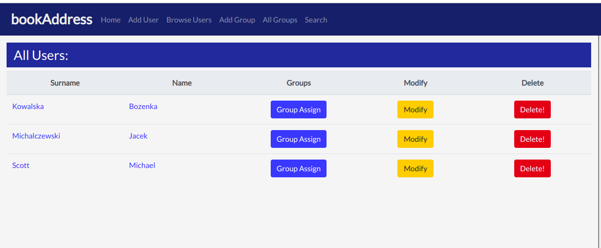
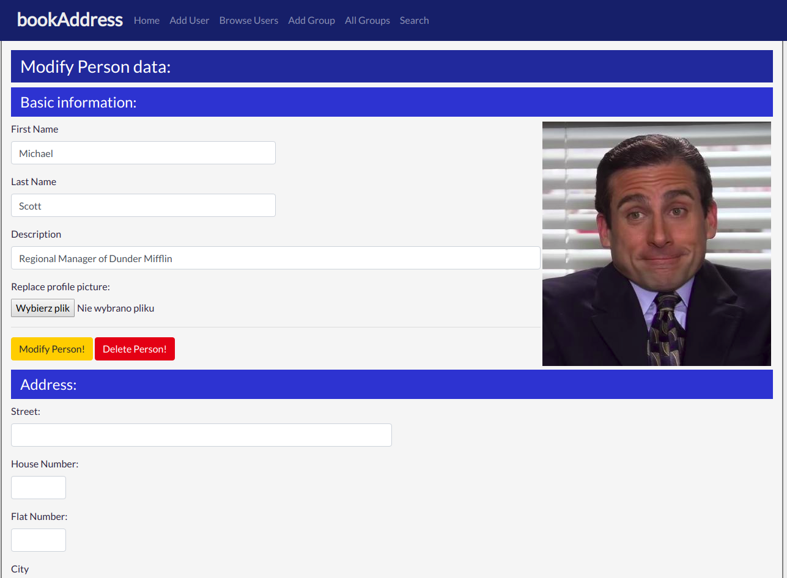
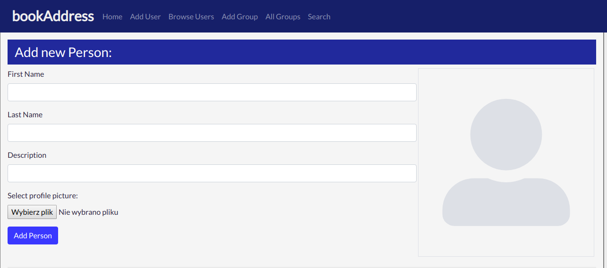
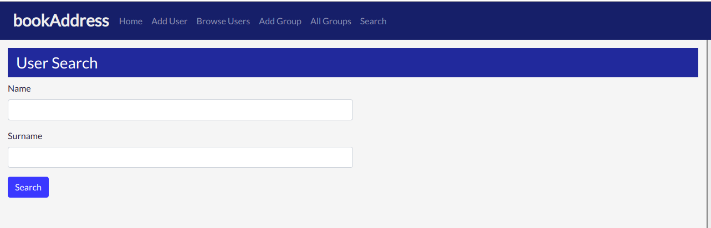
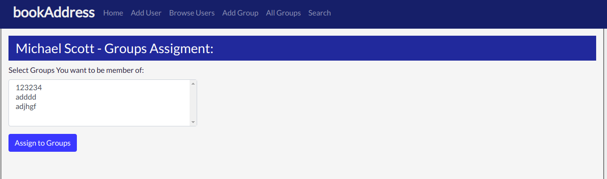
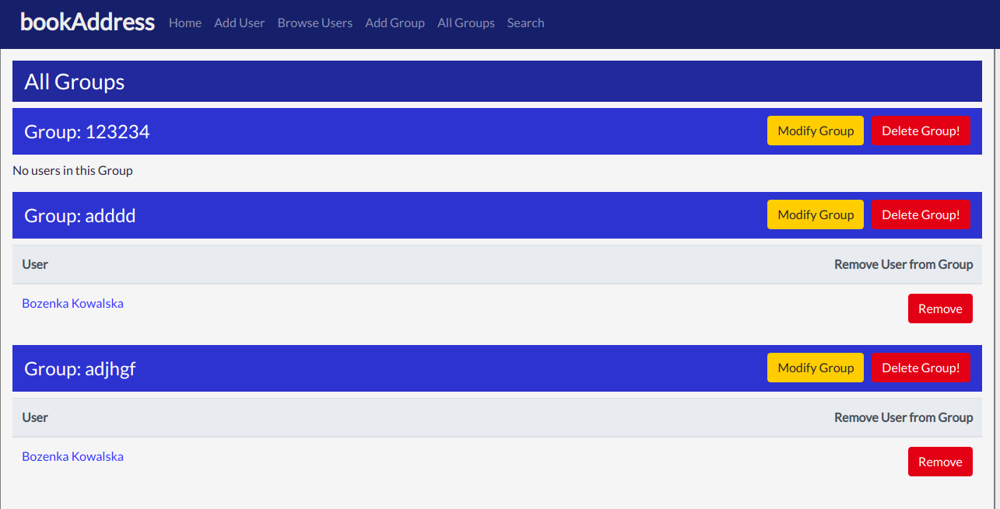
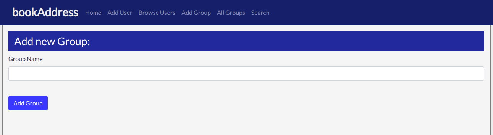

# Contacts Manager

Django web application for managing contacts.

## Installing
1. Clone the repository

2. Create a psql database. Name it "contacts"

3. Restore the dump:
```
psql -U postgres -W -f contacts_db.sql -h localhost contacts
```

4. Install the requirements:
```
pip install -r requirements.txt
```

5. Run server (http://127.0.0.1:8000):
```
python manage.py runserver
```

## About the app

Application allows users to:
<li> adding contacts: personal information, phone numbers, emails, photo </li>
<li> modifying contact information </li>
<li> creating, deleting user groups </li>
<li> adding contacts to groups </li>
<li> contacts search </li>

### All contacts


### Contact details


### Adding new contact


### User search


### Group assignment


### All contact groups


### Adding new group

